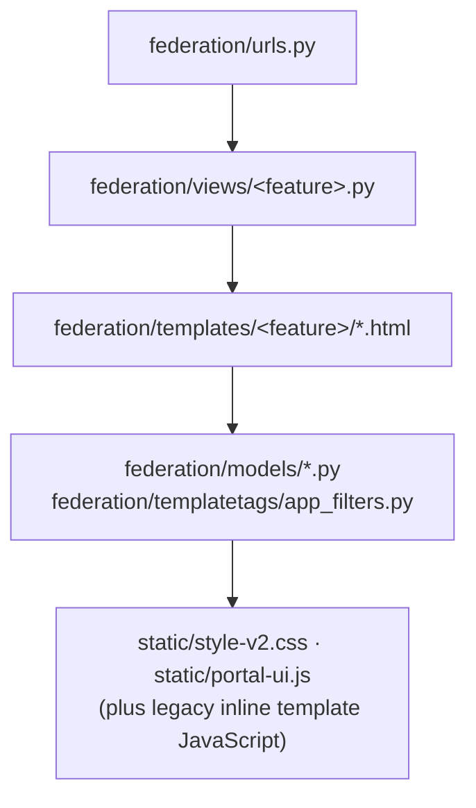

# Petanque Portal Developer Documentation

This is the entry point for developers maintaining Petanque Portal. It explains
where behavior lives, how public routes are assembled, how the main workflows
change data, and how the database is related.

The application is a server-rendered Django monolith. For a normal page, trace
behavior in this order:

## Start Here

1. [Architecture foundation](architecture.md) - engineering values, binding
   rules for backend/CSS/JS, technology stack, hosting, and CI/CD. Read this
   before your first PR.
2. [Project overview](project-overview.md) - stack, repository layout, runtime,
   configuration, and major domain areas.
3. [Local development](local-development.md) - how to use the existing Docker
   Compose stack and production-derived local database safely.
4. [Route index](route-index.md) - every public, authentication, export, API,
   admin, and framework route.
5. [Database schema](database-schema.md) - ER diagram, all domain tables,
   relationships, deletion behavior, indexes, and known live-schema drift.
6. [Operations and workflows](operations-and-workflows.md) - admin actions,
   scheduled jobs, tournament processing, season snapshots, and safe change
   procedures.

## Feature Documentation

| Area | Documentation |
| --- | --- |
| Registration, login, email confirmation, password reset, profile | [Authentication, registration, and profile](features/authentication-registration-profile.md) |
| Landing page, player list/detail, current ratings | [Home, players, and ratings](features/home-players-ratings.md) |
| Tournament list, detail, registration, exports, protocol, calendar | [Tournaments](features/tournaments.md) |
| Club list/detail, federation structure, title registries, records | [Clubs and federation registries](features/clubs-and-federation.md) |
| Seasons, statistics, and documents | [Seasons, statistics, and documents](features/seasons-statistics-documents.md) |
| Administrative journal and reverting changes | [Audit log and reverting changes](features/audit-log.md) |

## Existing Specialist References

- [API reference](api.md)
- [Season rating snapshots](season-rating-snapshots.md)
- [Audit index](audit/README.md)
- [Tournament display-name behavior](tournament-display-name-review.md)

## Source Of Truth

Use the following precedence when documentation and behavior disagree:

1. The running production-derived database is the data source of truth.
2. Applied migrations define what Django believes has been deployed.
3. Current models and code define application behavior.
4. These docs explain the current implementation but do not override code.

The live local database was inspected read-only on June 8, 2026. It has all
checked-in federation migrations through `0072` applied. It also contains
untracked schema described in [Database schema: live-only drift](database-schema.md#live-only-schema-drift).

## Common Change Paths

| Change | Usually edit | Verify |
| --- | --- | --- |
| Add or change a route | `federation/urls.py`, matching view, template | Django checks and the route in the browser |
| Change page data | matching file in `federation/views/` | query behavior and rendered page |
| Change page markup | matching file in `federation/templates/` | desktop/mobile browser views |
| Change shared layout/search/language | `templates/common/`, `views/api.py`, middleware | multiple representative pages |
| Change domain fields | model plus new migration | migration plan against a copy before production |
| Change rating behavior | `models/player.py`, `models/tournament.py`, rating config | focused tests and controlled data comparison |
| Change admin behavior | `admin.py`, model admin classes, `admin_actions/` | `/admin/` using non-production test records where possible |
| Change a scheduled workflow | management command, service, `conf/crontab.txt` | run command manually and inspect logs |

## Safety Rules

- Use the existing Compose project and services. Do not create a second stack or
  reset/reseed the production-derived database.
- The local app entry point is `http://localhost:60102/`; Adminer is
  `http://localhost:60103/`.
- After runtime code changes, rebuild the existing web service with
  `docker compose -p petanque-portal up -d --build petanque_portal_web_api`.
- Automated test coverage is thin (~134 tests in `federation/tests.py` and
  `federation/test_audit.py`). Treat rating, tournament processing,
  registration, permissions, and migrations as high-risk changes; tests are
  mandatory for rating/tournament logic.
- Publishing uses GitHub. Push the branch and open a GitHub pull request;
  merging to `master` triggers the automated production deploy
  (see [deployment.md](deployment.md)).
