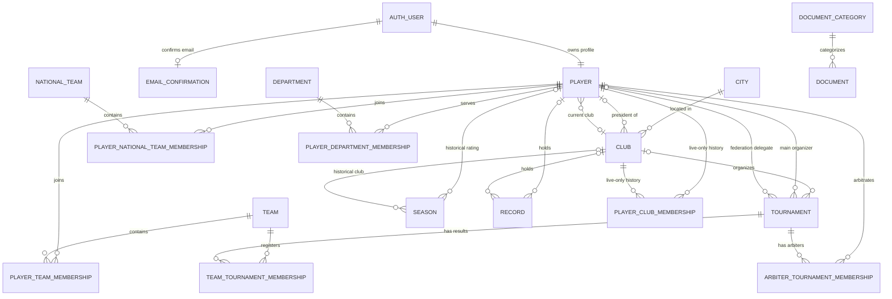

# Database Schema And Relationships

This document describes the checked-in Django schema and the production-derived
local PostgreSQL schema inspected read-only on June 8, 2026.

## Sources Of Truth And Migration State

- Models: `components/web-api/application/federation/models/`
- Migrations: `components/web-api/application/federation/migrations/`
- Database configuration: `components/web-api/application/api/settings.py`
- Local source-of-truth service/volume: `petanque_portal_db` / `petanque_db`

All checked-in federation migrations through `0072` are applied in the local
database. The live database also contains schema that is absent from checked-in
models and migrations; see [Live-only schema drift](#live-only-schema-drift).

Unless explicitly defined otherwise, Django uses an integer `id` primary key.
The current project emits warnings because `DEFAULT_AUTO_FIELD` is not
configured.

## Domain ER Diagram



`PLAYER_CLUB_MEMBERSHIP` is shown because it exists in the live database, but
it is not represented by checked-in code.

## Relationship Reference

| From field | To | Cardinality | Django delete behavior | Notes |
| --- | --- | --- | --- | --- |
| `Player.user` | `auth_user` | one-to-one, required | `CASCADE` | Unique database index on `user_id` |
| `EmailConfirmation.user` | `auth_user` | one-to-one, required | `CASCADE` | Unique `user_id`; unique token |
| `Player.current_club` | `Club` | many-to-one, optional | `SET_NULL` | Current assignment only |
| `Club.city` | `City` | many-to-one, optional in current model | `SET_NULL` | |
| `Club.president` | `Player` | many-to-one, optional | `SET_NULL` | Circular logical relationship with current club |
| `Tournament.organizer_club` | `Club` | many-to-one, optional | `SET_NULL` | |
| `Tournament.main_organizer` | `Player` | many-to-one, optional | `SET_NULL` | Related name `tournament_main_organizer` |
| `Tournament.federation_delegat` | `Player` | many-to-one, optional | `SET_NULL` | Related name `tournament_federation_delegat` |
| `Document.category` | `DocumentCategory` | many-to-one, required | `PROTECT` | Related name `documents` |
| `Record.player` / `Record.club` | Player / Club | optional many-to-one | `SET_NULL` | Either or both can be present |
| `Season.player` / `Season.club` | Player / Club | optional many-to-one | `SET_NULL` | No unique year/player constraint |
| Membership-table foreign keys | parent tables | many-to-one | generally `CASCADE` | Most are nullable in current models |

PostgreSQL reports `NO ACTION` on the physical foreign-key constraints. Django
implements model `on_delete` behavior before database deletion; do not assume
the database itself will apply `SET NULL`, `CASCADE`, or `PROTECT` when SQL is
executed outside Django.

## Core Identity And Player Tables

### `auth_user` (`django.contrib.auth.models.User`)

Authentication identity and permission flags. Important application-used
fields: `id`, `username` (unique), `password`, `email`, `is_active`, `is_staff`,
`is_superuser`, `last_login`, `date_joined`.

Related framework tables:

- `auth_group`
- `auth_permission`
- `auth_group_permissions`
- `auth_user_groups`
- `auth_user_user_permissions`
- `django_session`
- `django_admin_log`
- `django_content_type`
- `django_migrations`

Application references: registration/login/profile/password-reset views and
forms; `Player.user`; `EmailConfirmation.user`.

`django_admin_log` is also used as the administrative audit journal for
players, documents, and tournaments. New supported change entries store stable
field names and old/new snapshots inside `change_message`; no additional audit
table is introduced. See
[Audit log and reverting changes](features/audit-log.md).

### `federation_player`

Model: `models/player.py:Player`

| Field group | Fields |
| --- | --- |
| Identity relation | `id`, `user_id` required/unique |
| Public identity | `avatar`, `name`, `surname`, `second_name`, `birth_date`, `gender`, `country` |
| Club/license | `current_club_id`, `licence_number`, `is_licence_active`, `is_inclusive` |
| Play/profile | `prefred_position` (legacy misspelling), `facebook`, `twitter`, `instagram`, `website` |
| Roles/titles | `arbiter_level`, `coach_level`, `sport_title` |
| Current points | `current_rating`, `current_rating_b`, `current_rating_inclusive`, `current_rating_liga` |
| Current power | `current_power`, `current_power_b`, `current_power_inclusive` |
| Contributing results | `current_rating_tournaments`, `current_rating_b_tournaments`, `current_rating_inclusive_tournaments` as JSON text |

Important behavior is in `Player.get_actual_players_list`,
`Player.get_ranking`, and `Player.recalculate_ratings`.

Live-only columns `is_deaf_league_member` and `is_vvlp_league_member` are
described under [Live-only schema drift](#live-only-schema-drift).

### `federation_emailconfirmation`

Model: `models/email_confirmation.py:EmailConfirmation`

| Field | Type/constraint | Purpose |
| --- | --- | --- |
| `user_id` | required one-to-one to `auth_user` | confirmation owner |
| `email` | email string | address awaiting/holding confirmation |
| `token` | unique UUID | public confirmation token |
| `created_at` | timestamp | expiry basis |
| `confirmed` | boolean | confirmation state |
| `confirmed_at` | nullable timestamp | completion time |

Tokens expire after 24 hours in application logic.

## Clubs And Geography

### `federation_city`

Model: `models/city.py:City`

Fields: `id`, `name` (`varchar(150)`), `country` (`varchar(2)` country code).

### `federation_club`

Model: `models/club.py:Club`

| Field group | Fields |
| --- | --- |
| Identity/media | `id`, `name`, `short_name`, `logo` |
| Dates/location | `date_registered`, `date_created`, `address`, `city_id` |
| Leadership | `president_id` |
| Links | `facebook`, `twitter`, `instagram`, `website` |

Club rating and athlete counts are calculated from players whose
`current_club_id` points to the club. The checked-in application does not use
historical membership rows.

## Teams And Tournament Participation

### `federation_team`

Model: `models/team.py:Team`

Fields: `id`, nullable `name`, nullable cached/admin `admin_name`,
`date_created`.

A team is a reusable composition of players; its tournament-specific result is
stored separately in `TeamTournamentMembership`.

### `federation_playerteammembership`

Model: `models/team.py:PlayerTeamMembership`

Fields: `id`, nullable `player_id`, nullable `team_id`, `is_capitan` (legacy
misspelling).

This is the through table for `Team.players`. Application logic tries to keep
one captain, but there is no database constraint enforcing one captain or unique
`(player_id, team_id)`.

### `federation_tournament`

Model: `models/tournament.py:Tournament`

| Field group | Fields |
| --- | --- |
| Identity/classification | `id`, `name`, `category`, `format`, `country`, `place` |
| Rating flags | `is_goes_to_rating`, `is_b_tournament`, `is_inclusive`, `is_ukrainian_league` |
| Processing state | `is_ready_for_processing`, `is_processing_finished` |
| Rating values | `rating_coefficient`, `power`, `total_number_of_teams` |
| Dates | `start_date`, `start_time`, nullable `end_date`, nullable `date_registration_stop` |
| Registration | `number_of_players_in_team_min`, `number_of_players_in_team_max`, `teams_limit`, `fee` |
| Organization | `organizer_club_id`, `main_organizer_id`, `federation_delegat_id` |
| Content/files | `terms`, `notes`, `meta`, `final_notes` |

Choice values:

- `category`: `open`, `fpu`, `away`, `other`
- `format`: `swiss`, `swiko`, `ko`, `each`, `tir`, `mele`

### `federation_teamtournamentmembership`

Model: `models/tournament.py:TeamTournamentMembership`

| Field | Purpose |
| --- | --- |
| `tournament_id`, `team_id` | through relation |
| `place_min`, `place_max` | final or shared-place range |
| `date_registration` | team registration date |
| `power` | team power in this tournament |
| `rating_points` | points earned by the team/result |
| `rating_power` | result power value used in player power |

There is no unique constraint on `(tournament_id, team_id)`.

### `federation_arbitertournamentmembership`

Model: `models/tournament.py:ArbiterTournamentMembership`

Fields: `id`, nullable `tournament_id`, nullable `arbiter_id`,
`is_main_arbiter`.

There is no database constraint enforcing one head arbiter or unique
`(tournament_id, arbiter_id)`.

## Seasons, Records, And Federation Membership

### `federation_season`

Model: `models/season.py:Season`

Fields: `id`, nullable `player_id`, nullable historical `club_id`, `year`,
`rating`, `rating_b`, `rating_liga`.

There is no unique constraint on `(year, player_id)`. The season snapshot
service detects duplicate existing rows but does not automatically merge them.

### `federation_record`

Model: `models/record.py:Record`

Fields: `id`, `name`, optional `player_id`, optional `club_id`, `description`
(displayed value), optional `date_created`, optional `notes`.

### `federation_national_team`

Model: `models/national_teams.py:National_team`

Fields: `id`, `name`.

### `federation_playernational_teammembership`

Model: `models/national_teams.py:PlayerNational_teamMembership`

Fields: `id`, nullable `player_id`, nullable `team_id`, `position`.

Position choices: player, coach, head coach, captain, main squad. No unique
membership constraint exists.

### `federation_department`

Model: `models/department.py:Department`

Fields: `id`, `name`, `order`, `date_created`, optional `notes`.

### `federation_playerdepartmentmembership`

Model: `models/department.py:PlayerDepartmentMembership`

Fields: `id`, nullable `player_id`, nullable `team_id` (points to Department
despite the field name), `role`, optional `description`, `order`.

No unique membership constraint exists.

## Documents

### `federation_documentcategory`

Model: `models/document.py:DocumentCategory`

Fields: `id`, unique `code`, `name`, `order`, `is_active`.

Database indexes: primary key, unique `code`, and varchar-pattern index for
`code`.

### `federation_document`

Model: `models/document.py:Document`

Fields: `id`, `name`, optional `notes`, `file`, required `category_id`,
`is_active`, optional `document_date`, `created_at`, non-negative
`download_count`.

The category relation uses Django `PROTECT`. Download count is incremented by
the download view.

## Live-Only Schema Drift

The production-derived local database contains the following schema not present
in the checked-in models or migrations:

### `federation_playerclubmembership`

This table currently has 441 rows.

| Field | Live database definition |
| --- | --- |
| `id` | integer primary key |
| `player_id` | required FK to `federation_player` |
| `club_id` | required FK to `federation_club` |
| `date_start` | nullable date |
| `date_end` | nullable date |
| `source` | required `varchar(30)` |
| `notes` | required text |
| `date_created` | required timestamp |

Live indexes exist on each FK and on `(player_id, date_start, date_end)` and
`(club_id, date_start, date_end)`.

No checked-in code references this table. Until a matching model and migration
are recovered or created, Django cannot manage or reproduce it.

### Live-Only `federation_player` Columns

- `is_deaf_league_member boolean NOT NULL`
- `is_vvlp_league_member boolean NOT NULL`

No checked-in model, migration, view, or template references these columns.

### Required Follow-Up

Before any migration that touches `Player` or club membership:

1. Decide whether the live-only schema is intentional and still used.
2. Recover its source migration/model from deployment history if possible.
3. Add equivalent checked-in migrations without deleting or recreating data.
4. Test the migration plan against a copy of the production-derived database.

Do not run destructive migration repair commands against the source-of-truth
local volume.

## Indexes And Constraints

The live schema mainly has:

- Primary-key indexes on every table.
- Automatic indexes on foreign keys.
- Unique indexes for `Player.user_id`, `EmailConfirmation.user_id`,
  `EmailConfirmation.token`, and `DocumentCategory.code`.
- A non-negative check on `Document.download_count`.
- Live-only composite date-range indexes on player club history.

Notably absent:

- Unique `(year, player)` on seasons.
- Unique `(tournament, team)` on tournament memberships.
- Unique `(team, player)` on team memberships.
- Unique `(tournament, arbiter)` on arbiter memberships.
- Unique `(national_team, player)` and `(department, player)` memberships.
- Constraints enforcing a single captain or head arbiter.

Application code currently carries these invariants. Add constraints only after
checking existing duplicates and planning data cleanup.

## Storage And Country Fields

Image/file columns are database strings containing storage keys. File content
is local media or S3 depending on `api/settings.py` and `federation/storage.py`.

`django-countries` fields are stored as short country-code varchar columns:

- `City.country`: required.
- `Player.country`: required with configured default.
- `Tournament.country`: nullable.

## Read-Only Schema Inspection Commands

Use the existing stack and do not mutate data:

```bash
docker compose -p petanque-portal exec -T petanque_portal_web_api \
  python manage.py showmigrations federation

docker compose -p petanque-portal exec -T petanque_portal_db \
  sh -lc 'psql -U "$POSTGRES_USER" -d "$POSTGRES_DB"'
```

Adminer is available at `http://localhost:60103/`.
